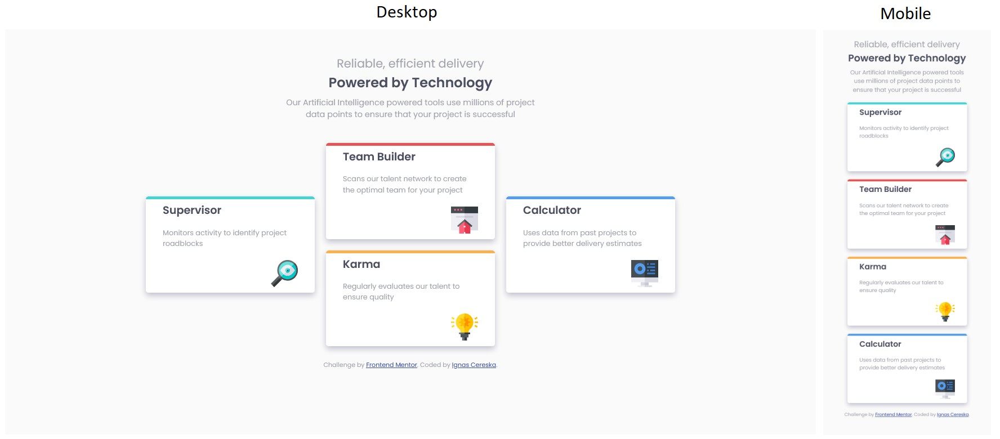

# Frontend Mentor - Four card feature section solution

This is a solution to the [Four card feature section challenge on Frontend Mentor](https://www.frontendmentor.io/challenges/four-card-feature-section-weK1eFYK). Frontend Mentor challenges help you improve your coding skills by building realistic projects. 

## Table of contents

- [Overview](#overview)
  - [The challenge](#the-challenge)
  - [Screenshot](#screenshot)
- [My process](#my-process)
  - [Built with](#built-with)
  - [What I learned](#what-i-learned)
  - [Continued development](#continued-development)
  - [Useful resources](#useful-resources)
- [Author](#author)

## Overview

### The challenge

Users should be able to:

- View the optimal layout depending on their device's screen size
- See hover states for interactive elements

### Screenshot



## My process

### Built with

- HTML5 and CSS
- Flex box
- Visual Studio Code software

### What I learned

The biggest lesson is about CSS reset practice. It turns out that different browsers might display certain styling differently. CSS reset is used to apply general styling to all elements and THEN use my own styling to apply whatever I want to those elements.

I have used this [CSS reset](https://www.markdownguide.org/) file. It was placed in index.html file before my own CSS style file so that CSS reset is applied first and then my CSS style.
```html
  <link type="text/css" rel="stylesheet" href="./css/reset.css">
  <link type="text/css" rel="stylesheet" href="./css/mainStyle.css">
```

Also, card top colors were originaly done using an empty div element, but then I realised that I can set color and thickness to top border of the card separately.

```css
div#greenCard {
    border-top-color: hsl(180, 62%, 55%);
}
```
The card element looks like this:
```html
<div class="card" id="greenCard">
    <h1>Supervisor</h1>
    <p>Monitors activity to identify project roadblocks</p>
    
</div>
```
I have used "card" class to apply general styling that is common between the cards (fonts, margins, etc.) and used id of each card to target specific color for each card.

### Continued development

I think the tricky part was to figure out how to place the two middle cards on top of each other on desktop version. Tricky, because I was trying to find a way to do it so that all cards are sitting within a single parent element. But had to resort to putting middle two cards inside a separate div element and arange them in column.

It is much easier to now to look at a design and be able to "slice" it into boxes in my mind as I am starting to plan. Much more confortable with flex box, but need to practice grid layout.

### Useful resources

- (https://www.w3schools.com) - My main goto when I need to remember certain things in html and css.

## Author

- Frontend Mentor - [@ignasc](https://www.frontendmentor.io/profile/ignasc)
- Github - [@ignasc](https://github.com/ignasc)
- Twitter - [@Ignasc](https://twitter.com/Ignasc)
- Instagram - [@ignas.c](https://www.instagram.com/ignas.c/)

## Acknowledgments

A big thank you to [palgramming](https://www.frontendmentor.io/profile/palgramming) for pointing out CSS reset in my previous work, which I applied in this work.